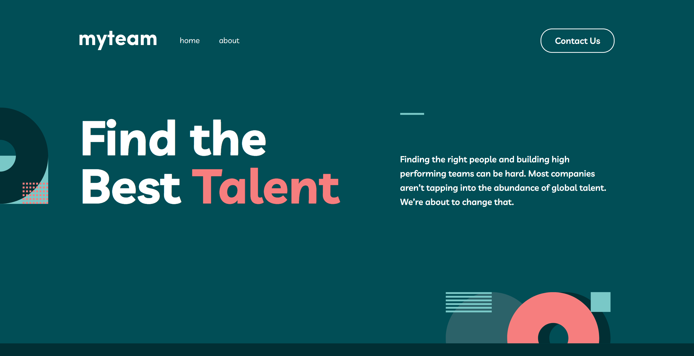

# myteam website solution

This is a solution to the [myteam website challenge on Frontend Mentor](https://www.frontendmentor.io/challenges/myteam-multipage-website-mxlEauvW). Frontend Mentor challenges help you improve your coding skills by building realistic projects. 

## Table of contents

- [Overview](#overview)
  - [The challenge](#the-challenge)
  - [Screenshot](#screenshot)
  - [Links](#links)
- [My process](#my-process)
  - [Built with](#built-with)
  - [What I learned](#what-i-learned)
  - [Continued development](#continued-development)
  - [Useful resources](#useful-resources)
- [Author](#author)

## Overview

### The challenge

Users are be able to:

- View the optimal layout for each page depending on their device's screen size
- See hover states for all interactive elements throughout the site
- See the correct content for each team member on the About page when the `+` icon is clicked
- Receive an error message when the contact form is submitted if:
  - The `Name`, `Email Address` or `Message` fields are empty should show "This field is required"
  - The `Email Address` is not formatted correctly should show "Please use a valid email address"

### Screenshot

### Links

# Links to be added
- Solution URL: [Add solution URL here](https://your-solution-url.com)
- Live Site URL: [Add live site URL here](https://your-live-site-url.com)

## My process

### Built with

- Semantic HTML5 markup
- CSS custom properties
- Flexbox
- CSS Grid
- Mobile-first workflow
- [React](https://reactjs.org) - JS library
- [Next.js](https://nextjs.org) - React framework
- [TailwindCSS](https://tailwindcss.com) - For styles

### What I learned

It helped solidified my handling of basic client-side form validation and using grid for the overall layout of a website. It was also good to use next.js more and use the app router to create a small multi-page website and incorpate the benfits of using SSR for this type of website.

### Continued development

In the future, I want to use Next.js to build more interactive/expansive websites like a blog, Ecommerce Site or use it as an headless CMS with a content managment system like strapi, contentful, wordpress or shopify, as I feel like in these sort of websites you can really see the benefits of using a technology like next.js. Where you can build your site like a spa application, but can also use SSR, SSG, ISR and many different ways of rendering the html content and dynamic data, as well as all the added SEO benefits these can bring to your site.

In this project it also occured to me that I need to work on my folder architecture when building projects. As I noticed in this project, my folder structure was quite messy and will need to improve, especially when working with nested components.

### Useful resources

- [MDN](https://www.example.com) - MDN Docs is always a good source to reference when building a project.

## Author

- Website - [David Henery](https://www.djhwebdevelopment.com)
- Frontend Mentor - [@David-Henery4](https://www.frontendmentor.io/profile/David-Henery4)
- linkedIn - [David Henery](https://www.linkedin.com/in/david-henery-725458241)

